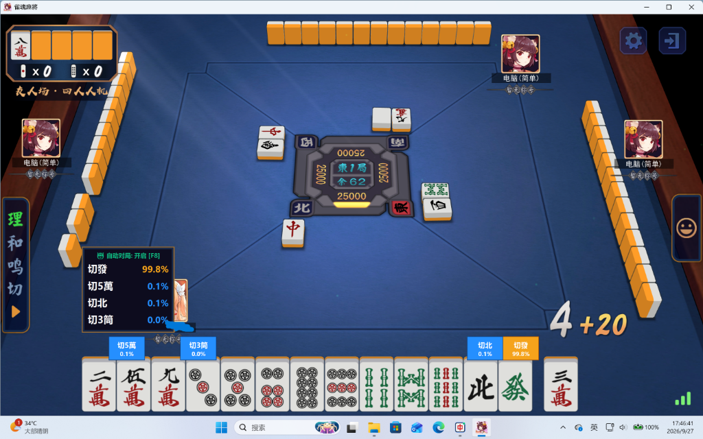
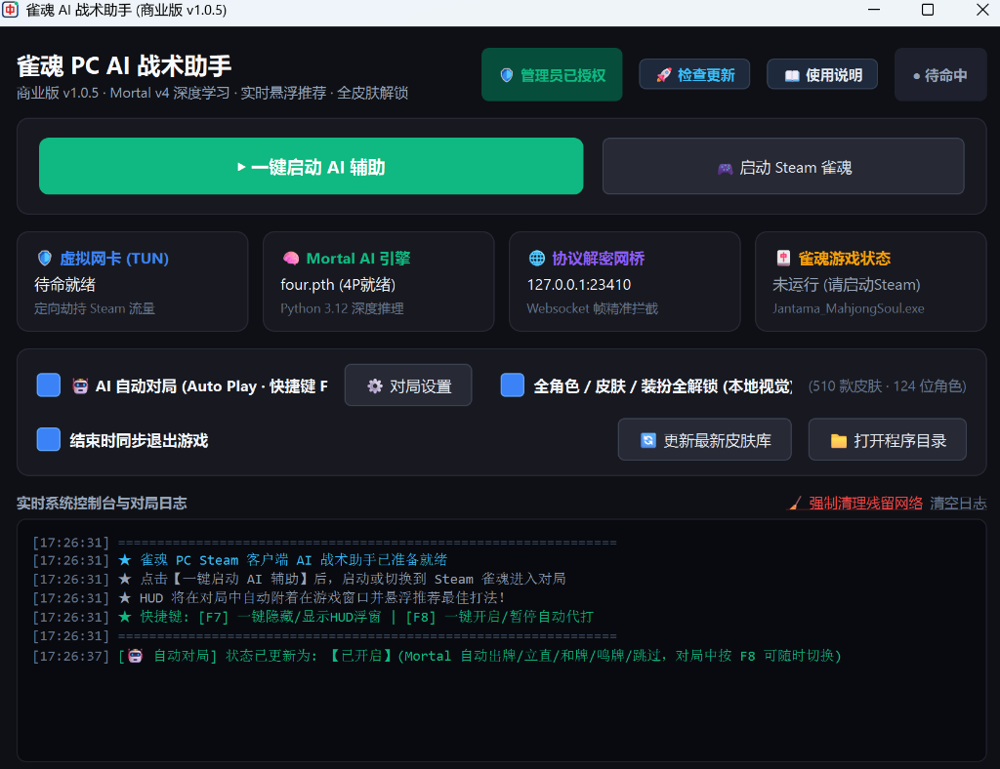
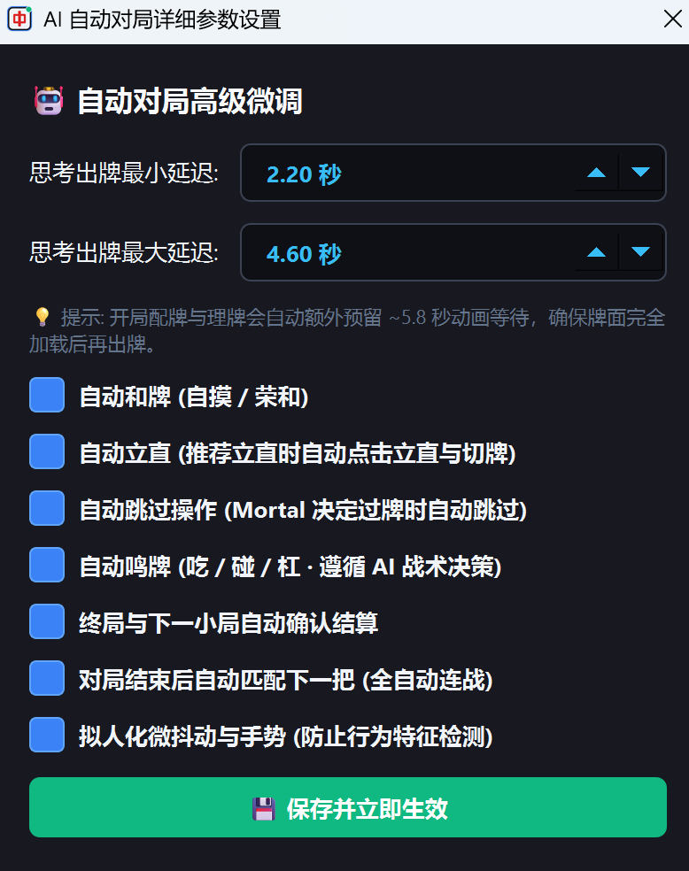

# 🀄 雀魂智囊助手 (Zizhi MahjongSoul Assistant) - 商业版

  
  
  
  

  <b>面向 Steam PC 雀魂端的高精度深度学习决策与智能战术辅助系统</b>
   
  <i>In-Memory Mortal AI Engine | Click-Through HUD Overlay | Adaptive Auto-Play | Zero-Config TUN</i>

---

## 📸 软件实际界面展示 (Screenshots)

### 1. 战术 HUD 实战对局悬浮推荐
> 悬浮窗自适应附着于 Steam 游戏窗口，透明置顶、点击穿透，实时高亮最优打法概率与各张手牌期望得点！

  

---

### 2. 现代深色控制面板
> 一键拉起环境分流、AI 推理引擎与游戏进程监控，运行状态一目了然。

  

---

### 3. 拟人化智能代打微调设置
> 支持出牌最小/最大随机思考延迟、和牌/立直/鸣牌自主策略微调与多小局连战挂机。

  

---

## 🌟 核心功能特性

| 功能模块 | 说明 |
| :--- | :--- |
| 🧠 **Mortal 深度学习神经网络** | 内嵌 4P / 3P 双模型权重，对当前牌效、向听数、危险度与终局期望得点进行万级参数深度推理。 |
| 🖥️ **无缝透明战术 HUD** | 随游戏窗口无感缩放与移动，完美融入原版游戏界面，对局中按 **`[F7]`** 键可一键瞬间隐藏/呼出。 |
| 🤖 **拟人化自适应代打** | 拒绝机械秒出牌！支持自定义随机思考延迟区间，模拟真人操作节奏。对局中按 **`[F8]`** 键可随时一键暂停/继续。 |
| 🌐 **底层网络虚拟网卡 (TUN)** | 基于 Sing-box 定向分流技术，精准拦截 Steam 游戏流量，无需配置代理端口或导入根证书。 |
| 🔄 **云端静默自更新** | 客户端内置版本热更新服务，检测到新特性或算法优化时一键平滑升级，永久保持最新战力。 |

---

## 🚀 极简使用教程

### 第一步：下载软件包
前往本仓库右侧的 [**Releases**](https://github.com/) 页面，下载最新发布的 `雀魂智囊助手_商业版_v1.0.6.zip`。

### 第二步：解压与运行
1. 将下载的 ZIP 压缩包解压到任意文件夹（建议路径不含特殊符号）。
2. 鼠标双击打开 `雀魂智囊助手_商业版.exe`（软件会自动申请管理员权限以创建虚拟网络分流接口）。

### 第三步：输入卡密激活
1. 首次打开会弹出授权激活对话框。
2. 粘贴您获取到的**商业授权卡密**，点击【立即激活绑定】（一机一码自动绑定硬件）。

### 第四步：畅享对局
1. 在主界面点击绿色大按钮 **【▶ 一键启动 AI 辅助】**。
2. 打开 Steam 客户端启动《雀魂麻将》，进入任意段位战、比赛或人机友人房。
3. 发牌后，战术 HUD 将全自动出现在手牌上方提供实时胜率与切牌指引！

---

## 💬 获取正版卡密 & 售后咨询

- ✈️ **Telegram 官方联系**：[https://t.me/xrw_my](https://t.me/xrw_my)  
  *(点击链接或在 Telegram 搜索 `@xrw_my` 咨询购买商业授权、定制功能或反馈技术问题)*

---

## ⚠️ 常见问题排查 (FAQ)

- **Q: 为什么提示需要管理员权限启动？**  
  A: 软件底层采用工业级 TUN 虚拟网卡协议定向截取 Steam 数据包，需要 Windows 管理员权限创建本地网络路由，属于正常操作。
- **Q: 杀毒软件（如 360 / Windows Defender）误报怎么办？**  
  A: 本软件对深度学习模型与二进制字节码进行了高强度加密和代码混淆，某些安全软件因无法识别加密结构可能产生误报。请将解压目录加入白名单或信任区即可放心运行。
- **Q: 更换电脑或重装系统后卡密还能用吗？**  
  A: 卡密为一机一码硬件绑定。如遇更换电脑硬件或设备损坏，请直接联系作者 Telegram ([@xrw_my](https://t.me/xrw_my)) 申请重置解绑。

---

## ⚖️ 免责声明
本软件为开源麻将博弈算法学习与人机对战复盘研究工具。技术本身中立，请使用者自觉遵守所在游戏平台的用户协议与社区准则，切勿用于任何非法牟利场景。
